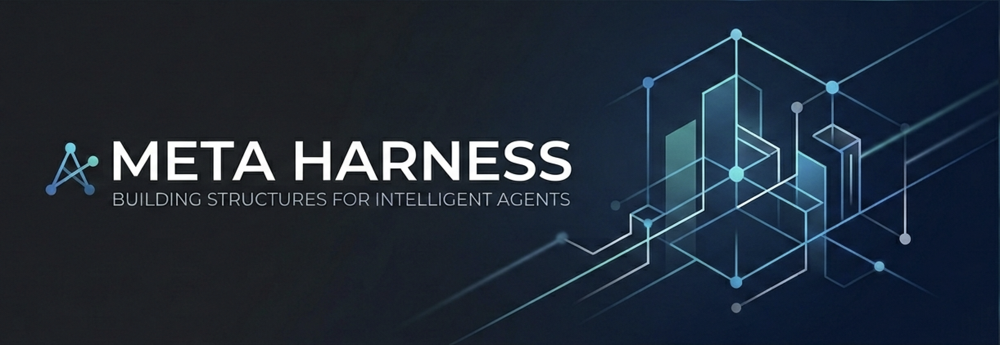

<p align="center">
  
</p>

<p align="center">
  <a href="LICENSE"></a>
  
</p>

# Meta Harness

Meta Harness is a Codex-native meta-skill for designing domain-specific workflows, reusable specialist skills, and deterministic handoff artifacts.

Adapted from [the original Harness project](https://github.com/revfactory/harness) and distributed here under the same [Apache 2.0](LICENSE) license.

## What This Adds

Compared to the original Claude Code-based Harness, this project adds:

- a Codex-native repository layout built around `AGENTS.md`, `.agents/skills/`, and `docs/harness/`
- runtime-neutral artifact contracts based on skills, team specs, and deterministic `_workspace/` handoffs
- a tighter maintenance loop through repo-local validation and simpler, platform-independent conventions

## What It Includes

- a 6-phase workflow for analysis, architecture, generation, integration, and validation
- 6 architecture patterns: Pipeline, Fan-out/Fan-in, Expert Pool, Producer-Reviewer, Supervisor, and Hierarchical Delegation
- repo-local skills under `.agents/skills/`
- durable output specs under `docs/harness/`
- deterministic `_workspace/` handoff conventions
- a small validation script for repository consistency

## Docs

- [Installation](docs/installation.md)
- [Sample Prompts](docs/sample-prompts.md)
- [Harness Output Specs](docs/harness/README.md)

## Repository Layout

```text
harness/
├── AGENTS.md
├── .agents/skills/harness/
│   ├── SKILL.md
│   └── references/
├── docs/harness/README.md
├── scripts/validate_codex_port.py
└── LICENSE
```

## Use

1. Read [AGENTS.md](AGENTS.md).
2. Read the main skill at [.agents/skills/harness/SKILL.md](.agents/skills/harness/SKILL.md).
3. Generate the smallest durable artifact set that fits the domain:
   - `.agents/skills/<domain>-orchestrator/SKILL.md`
   - `.agents/skills/<specialist>/SKILL.md`
   - `docs/harness/<domain>/team-spec.md`
   - `_workspace/{phase}_{role}_{artifact}.md`

Good requests for Harness:

```text
Build a reusable research harness for this repository.
Design a review workflow with explicit QA handoffs.
Define specialist skills and a team spec for this domain.
```

## Workflow and Patterns

The main skill preserves the 6-phase workflow:

1. Domain Analysis
2. Team Architecture Design
3. Role and Artifact Definition Generation
4. Skill Generation
5. Integration and Orchestration
6. Validation and Testing

Pattern guidance lives in [.agents/skills/harness/references/agent-design-patterns.md](.agents/skills/harness/references/agent-design-patterns.md). Output-spec conventions live in [docs/harness/README.md](docs/harness/README.md).

## Validation

```shell
python3 scripts/validate_codex_port.py
```

This checks required files, README links, main-skill headings, pattern coverage, and the absence of removed runtime-specific paths in the canonical docs.

## License

Apache 2.0
